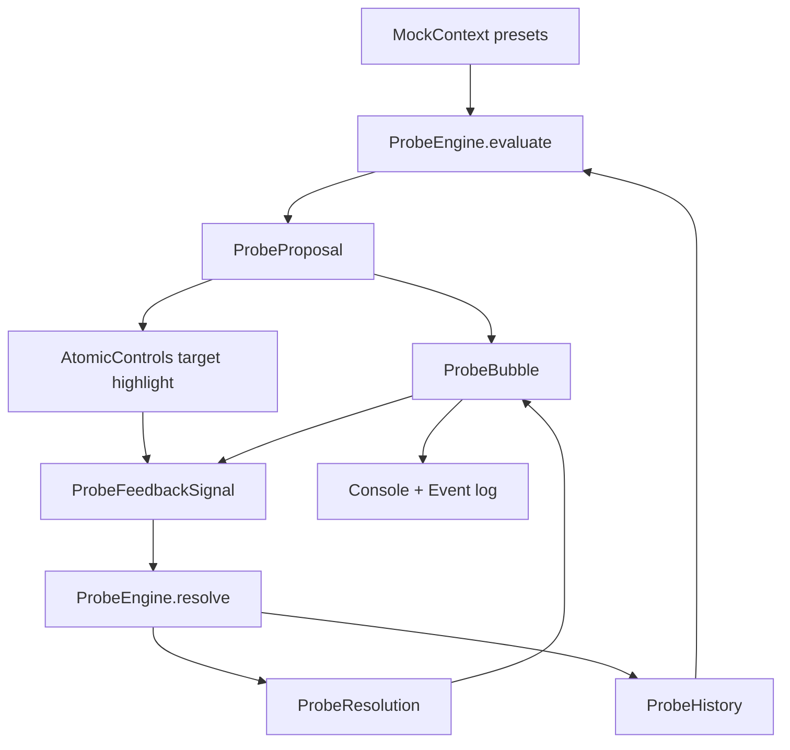
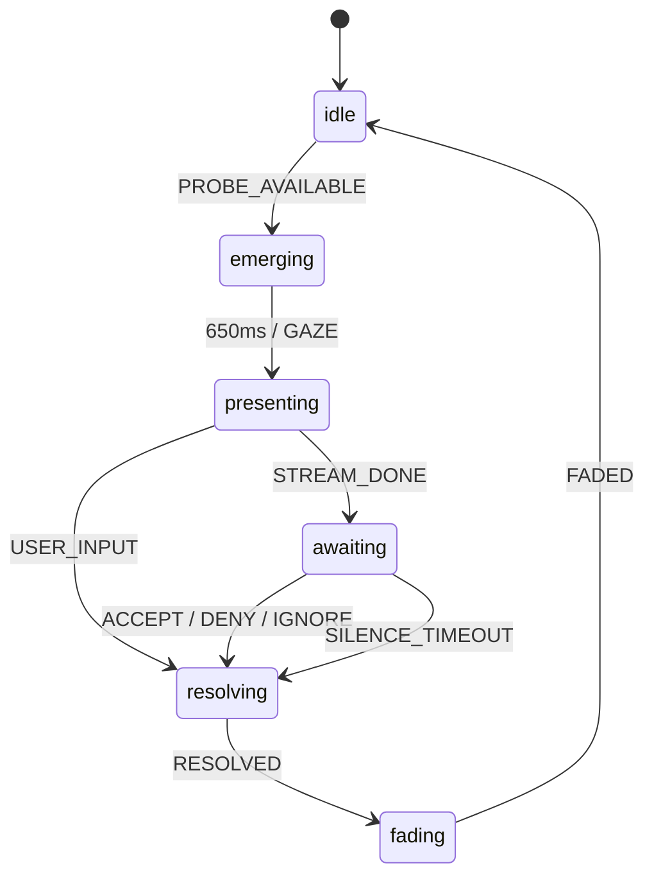

# 试探式交互原子控件

Phase 1 原型：用按钮、开关、滑块验证“试探 - 澄清 - 校正”的最小闭环。项目是纯前端 Vite + React + TypeScript，样式用 Tailwind CSS，ProbeBubble 动画用 Framer Motion。

## 安装和启动

```bash
npm install
npm run dev
```

构建检查：

```bash
npm run build
```

## 使用说明

1. 进入页面后，点击右上角 `试探一下` 生成一个 ProbeBubble。
2. 左侧切换 4 个 MockContext 场景：城市晚高峰、高速沉默、停车休息、新用户低信任。
3. 观察底部 ProbeBubble 的状态：`emerging -> presenting -> awaiting -> resolving -> fading`。
4. 在 `presenting` 阶段点击气泡或操作任意原子控件，会被视为“听到了/被打断”。
5. 在 `awaiting` 阶段：
   - 点击气泡里的 `可以 / 不对 / 先别` 产生明确反馈。
   - 操作被高亮的原子控件会被视为接受该试探。
   - 操作不匹配的原子控件会被视为校正或否认。
   - 沉默超时会按 ProbeEngine 策略被记录为默认接受或忽略。
6. 右侧事件日志与浏览器控制台会记录状态转换和反馈结果。

## 架构设计

### ProbeEngine 核心接口

```ts
export interface ProbeEngine {
  evaluate(
    context: MockContext,
    history: ProbeHistory,
    options?: { force?: boolean },
  ): ProbeEvaluation;

  resolve(
    probe: ProbeProposal,
    feedback: ProbeFeedbackSignal,
    history: ProbeHistory,
  ): ProbeResolution;

  reduceHistory(
    history: ProbeHistory,
    probe: ProbeProposal,
    feedback: ProbeFeedbackSignal,
  ): ProbeHistory;
}
```

设计要点：

- `evaluate` 把上下文和历史转换为一个试探假设，而不是直接执行动作。
- `resolve` 把用户反馈转换为下一步策略：继续、冷却、更明确、后退。
- `reduceHistory` 保留长期关系的最小记忆：接受、否认、忽略、中断、连续失败。

### ProbeBubble 状态机（XState 风格）

```ts
export const probeMachineConfig = {
  id: "probeBubble",
  initial: "idle",
  states: {
    idle: { on: { PROBE_AVAILABLE: "emerging" } },
    emerging: {
      after: { 650: "presenting" },
      on: { GAZE: "presenting", CANCEL: "fading" },
    },
    presenting: {
      on: { STREAM_DONE: "awaiting", USER_INPUT: "resolving" },
    },
    awaiting: {
      after: { SILENCE_TIMEOUT: "resolving" },
      on: { ACCEPT: "resolving", DENY: "resolving", IGNORE: "resolving" },
    },
    resolving: { after: { 1100: "fading" } },
    fading: { after: { 520: "idle" } },
  },
};
```

### 组件关系图



### 状态流



## 设计决策记录

### 已做假设

- 流式节奏按场景估算：驾驶负载越高越慢，亲密度越高越快，连续失败后也会变慢。
- 3 秒不是常量，而是原型锚点：高速、低信任、打断成本高、连续失败会延长等待。
- 连续失败 3 次后，系统不再把沉默视为默认接受，转为“需要明确反馈”。
- `interrupt` 不等于失败；它更像 turn-taking 中的“用户正在处理别的输入”。
- 原子控件既是动作入口，也是反馈入口；目标控件匹配时算接受，不匹配时算校正。
- 关系试探只在可逆、低风险动作上启用，例如停车后的休息位强度。

### 需要用户确认

- “沉默 = 接受”的边界：导航、车控、舒适性动作是否应分安全等级？
- 流式节奏是否需要真实注视/阅读速度参与，而不是只按场景和亲密度推断？
- 连续失败后的策略：当前原型选择“更保守 + 更明确”，是否符合你对副驾感的预期？
- 关系试探的措辞：`我们已经停稳了` 这类关系语言是否足够自然，还是过早拟人？
- 原子控件反馈语义：用户操作不匹配控件时，是“否认当前假设”还是“并行任务”？

### 发现的问题和替代方案

- 问题：状态试探和意图试探在车内常常重叠，例如“服务区”既可能是疲劳状态，也可能是导航意图。
  替代方案：让 ProbeProposal 支持多标签层级，并在 UI 上只暴露主层级。
- 问题：沉默语义很危险，尤其是驾驶场景。
  替代方案：只对低风险、可逆、亲密度高的动作允许默认接受；其他动作沉默只算忽略。
- 问题：连续失败后“更直接”可能听起来更强势。
  替代方案：将直接性拆成两个变量：措辞明确度上升，主动频率下降。
- 问题：当前 MockContext 没有真实时间序列，无法验证长期关系积累。
  替代方案：下一阶段加入 session timeline，把每次反馈写入可回放日志。

## 代码里的讨论标记

关键不确定点保留在 `src/probe/probeEngine.ts` 中，搜索：

```text
TODO: 与用户讨论
```
